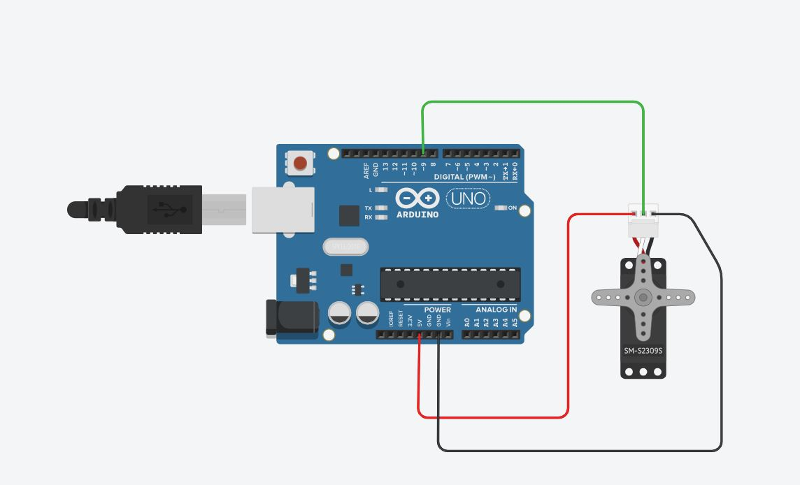

# AUTOMATIC BOOM BARRIER USING FACE DETECTION

> Gate-open-system-facial-recognition

### Abstract ###

Security systems have suggested various preferred approaches like biometric and
password to enhance security. The technology is developing day by day and growing with
the usage of different equipments. The trend has been moved from fingerprint to face
recognition. So face recognition technique has been utilized in this system for unlocking
the gate. Facial recognition technology can be used in various industries and corporate
sectors. This is about door unlocking system that mainly uses facial recognition
technology. The camera is used to capture the face images and the images are sent to
the database. If the image matches with the administration image then gate will be
unlocked and an acknowledgement is saved in the database system. If face is not
matched, then a warning message will be sent to the admin device, as someone is trying
to unlock the gate.

### Circuit Diagram ###

- Servo Motor Signal Pin will be Connected to the arduino
PWM Pin Number 9. The 5V pin will be connected to
Arduino 5v pin and Ground pin will be connected to Arduino
Ground pin. Arduino must be connected to PC through
arduino Cable.
- At first the python code will be write on any of the python
IDE than arduino code will be uploaded to arduino Uno
board using arduino IDE and then Run the 1st python code it
will collect the sample pictures and then run 2nd code and it
will start the webcam and take pictures , if the picture match
with database upto 83% then it will send a signal to the
arduino and arduino will drive the servo motor for 5 seconds.

### Hardware Components ###

**1. Arduino Uno**

**2. Servo Motor**

**3. Web Cam**

### Software Components ### 

**1. Pycharm IDE**

PyCharm is an integrated development environment
used in computer programming, specifically for the
Python programming language. It is developed by the
Czech company JetBrains.

**a) Django**

Django is a high-level Python web framework that
encourages rapid development and clean, pragmatic
design. Django makes it easier to build better web apps
quickly and with less code.

**b) OpenCV-python**

OpenCV is a library of programming functions mainly
aimed at real-time computer vision. Originally developed
by Intel.

**c) Pyserial**

PySerial is a Python API module which is used to read
and write serial data to Arduino or any other
Microcontroller.

**d) Pyttsx 3**

Pyttsx 3 is a text-to-speech conversion library in Python.
Unlike alternative libraries, it works offline and is
compatible with both Python 2 and 3.

**2. Arduino IDE**

The open-source Arduino Software (IDE) makes it easy
to write code and upload it to the board. This software
can be used with any Arduino board.

## License

- **[MIT license](http://opensource.org/licenses/mit-license.php)**
- Copyright 2015 © <a href="http://fvcproductions.com" target="_blank">FVCproductions</a>.
